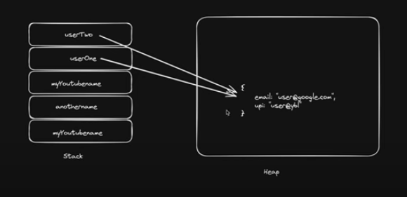

- [Variables](#variables)
- [DataTypes](#datatypes)
  - [Primitive](#primitive)
  - [Non-Primitive](#non-primitive)
  - [Memory](#memory)
- [TypeConversion](#typeconversion)
  - [convert to Boolean](#convert-to-boolean)
  - [convert to String](#convert-to-string)


<hr>

## Variables
- ### var
  - Global Scoped 
  - where the variables defined outside the function can be accessed globally & variables defined inside the function can be accessed within the function.
- ### let
  - Block Scoped
  - where it can't be accessible outside the particular block.
- ### const
  - Block Scoped
  - When users declare the const variable, they need to initialize it otherwise, it returns an error.
  - Cannot be updated once its declared.
```javascript
    const accountId = 34217;
    let accountEmail = "bk@gmail.com"
    var accountPassword = "12345"
    accountCity = "BAM"
    let accountState;
    // accountId = 258  // can not be reassigned.
    accountEmail="qwe@gmail.com"
    accountPassword="456321"
    accountCity="BBSR"

    /*
    Prefer not to use var, because of issue in block and functional     scope.
    */
    console.log(accountId);
    console.table([accountId, accountEmail, accountPassword,    accountCity, accountState])
``` 

## DataTypes
### Primitive
- #### String
  - Double Quotes : "Hello"
  - single Quotes : 'Hello'
  - BackTicks : Hello, this is the extended functionality of quotes.which allows us to embed the variables & expressions into string by wrapping them in `  ${........} `
- #### Number
  - represents both integer and floating numbers
  - limits upto (253 - 1)
  - Special numeric values - Infinity, -Infinity, NaN
- #### Boolean
  - has only 2 values - true, false.
- #### Null
  - represents as its just empty, novalue.
- #### unDefined
  - where value is declared/ initialized but not assigned.
- #### BigInt
  - same as type number, but can store really larger integers.
  - cretaed by adding 'n' to the end of an integer.
  - denoted by '165481515151516515451651615165n'
- #### Symbol
  - used to create unique identifiers for objects.

### Non-Primitive
- #### Arrays
- #### Objects
- #### typeOf operator
  - returns the type of the operand. Helps to do a quick check the dataType of the operand.
  - used as typeof x or typeof(x)
  - always returns the value in <b>string</b> DataType.
```javascript
    typeof(123)  // "number"
    typeof(typeof 123)  // "string"
    typeof(null) //object

    const id = Symbol( '123' )
    console.log(typeof (id))
    // *****************************************
    const arr = [ 1, 2, 3, 4, 5]
    console.log( typeof arr)
    // *****************************************
    const obj = {
      name : ' Bhawani_K ',
      age : 22
    }
    console.log(typeof (obj))
    // *****************************************
    const myFunction = function(){
      console.log( ' Hello World ' )
    }
    console.log( typeof myFunction)
```

### Memory
  - #### stack
    - Primitive
    - where we get the copy of the declared variable
  - #### Heap
    - Non-Primitive
    - where we get the refrence of the variable ,
    - If we change something, it changes in the original value
      
```javascript
    let myName = ' Bhawani_K'
    let myNickName = myName
    myNickName = 'Soni'
    
    console.log(myName)  // 
    console.log(myNickName)  // 
    
    let userOne = {
      email : 'user.google.com',
      upi : 'user@ybl.com'
    }

    let userTwo = userOne

    userTwo.email = 'abc@gmail.com'

    console.log(userOne.email)  // abc.gmail.com
    console.log(userTwo.email)  //abc.gmail.com
```

## TypeConversion
  - ### convert to Number
    - #### Number(value to Convert)
    - numeric conversion rules :
        | Value        | After Conversion                                                                                                     |
        | ------------ | -------------------------------------------------------------------------------------------------------------------- |
        | undefined    | NaN                                                                                                                  |
        | null         | 0                                                                                                                    |
        | true & false | 1 and 0                                                                                                              |
        | string       | Whitespaces are removed. If string is empty, the result is 0.If number & string is mixed, it results in an error NaN |
 	
	
<strong>*NOTE </strong>
    - Here null & undefined behave differently, 
      - Null becomes Zero 
      - undefined becomes NaN.

### convert to Boolean
- #### Boolean(value to Convert)
    - Values such as an empty string, 0, null, undefined & NaN, the value gets false.
    - else other values are true.
### convert to String
- #### String(value to Convert)
  - Operations
    - +, -, *, /, %, **, etc..
```javascript
    console.log(' 1 ' + 2) // 12
    console.log( 1 + ' 2 ') // 12
    console.log( ' 1 ' + 2 + 2) // 122 => as 1st element is string, it converts everything to string.
    console.log( 1 + 2 + ' 2 ') // 32 
```
  - PreIncrement
    - where the value is increased and immediately use the result of the operator
```javascript
    let counter = 0;  alert( ++counter ); // 1 
    let counter = 1;  alert( 2 * ++counter ); // 4 
```
  - PostIncrement
      - where the value gets increased, but its previous value.
```javascript
    let counter = 0;  alert( counter++ ); // 0 
    let counter = 1;  alert( 2 * counter++ ); // 2, because counter++ returns the "old" value
```
- ### Comparision
   , <, =, <=, >=, !=, ==, ===
  - Boolean value is the result, i.e. it may be true or false.


