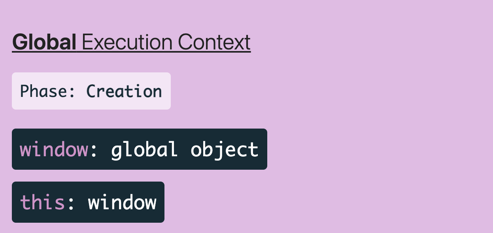
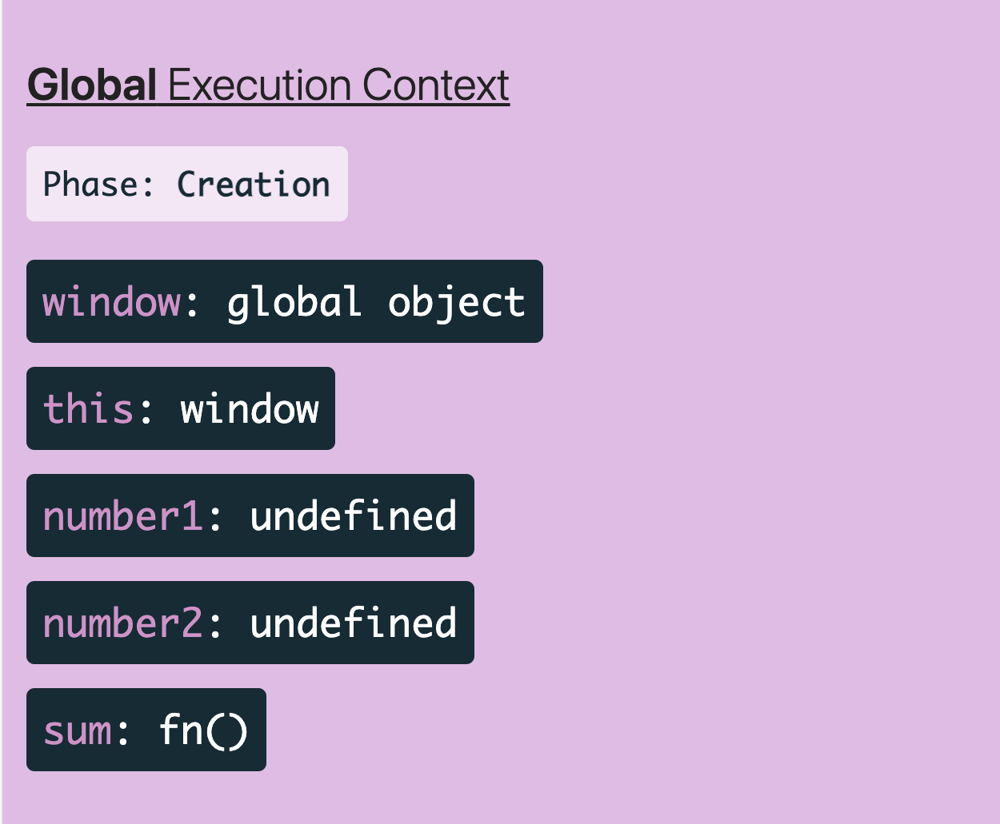
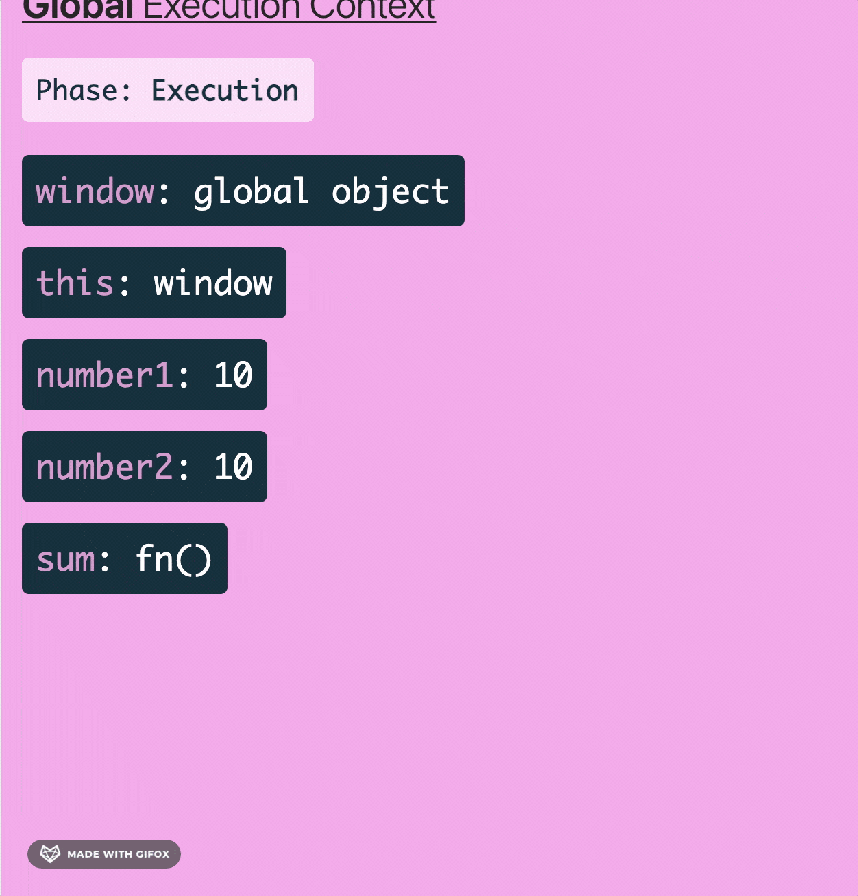

- [Execution Context](#execution-context)
  - [Global Execution Context](#global-execution-context)
      - [Every Execution Context consists of 2 things:](#every-execution-context-consists-of-2-things)
      - [2 phases of GlobalExecutionContext:](#2-phases-of-globalexecutioncontext)
  - [Function Execution Context](#function-execution-context)
  - [Eval Execution Context](#eval-execution-context)
- [ExecutionContext Vs Scope](#executioncontext-vs-scope)
- [Call Stack](#call-stack)
- [RecursiveFunction / StackOverFlow](#recursivefunction--stackoverflow)
- [Summary](#summary)


## Execution Context
- Execution Context is the concept which holds the information about the enviornment where the current code is being executed.

Different Types of javaScriptExecutionContexts
1. Global Execution Context
   - This is created by Default in Javascript Engine.
2. Function Execution Context
   - created whenever the function is executed.
3. Eval Execution Context
   - created inside the eval function.

### Global Execution Context
- created when the javascript engine runs the code. Here, the JavaScript Engine creates a new execution context which is called GlobalExecutionContext, which is by default created by Javascript Engine.
- Here, global code is not inside a function or object.


##### Every Execution Context consists of 2 things:
1. Global Object
   - which provides variables and functions that are available anywhere inside the current environment.
   - The global Object, in browser is named as "window".
   - The global Object, in Nodejs is named "global".

2. This Object
   - which points to the current object of execution context where the code belongs.

The JS engine still creates the globalExecutionContext even we dont have any code written in it.
* JS is single threaded so, it's not possible to have more than oneGlobalExecutionContext for a JS execution.
```javascript
var number1 = 10;
var number2 = 10;
function sum(n1, n2) { 
  return n1 + n2;
}
```

##### 2 phases of GlobalExecutionContext:
1. Creation
   - Here, the global object and "this" keyword is created.
   - Memory is allocated for the variables and functions created.
   - Here, the variables hold the value of "undefined".
2. Execution
   - Here, the execution of code starts.

### Function Execution Context
- created when a function is executed.

- This has the same phases and we have access to the special values called arguments.
- Every time a function is executed, the new functionExecutionContext is created.

### Eval Execution Context
- is created for turning a string into an executable javaScript Code.
- not recommended, as this eval function recieves can be a malicious string which can totally destroys the database or application. Due to which the eval function is deprecated and not used.

## ExecutionContext Vs Scope
- Scope is function-based. Scope belongs to the variable access of a function. There are only two scopes in JavaScript — global and function scope.
- Execution context is object-based. Execution context is an abstract concept that holds information about the environment where the current code is being executed. A context of a function is the value of the this keyword for that function.


## Call Stack
- call stack is a way to keep track of multiple function calls.
- Call Stack is a data structure, which uses the LastInFirstOut(LIFO) principle to temporarily store and manage the invocation of functions.
- <b> LIFO </b> : LastInFirstOut means that the last function which gets pushed into the stack and first to be popped out, when the function returns.

```javascript
function firstFunction(){
  console.log("Hello from firstFunction");
}
function secondFunction(){
  firstFunction();
  console.log("The end from secondFunction");
}
secondFunction();
```
1. When <code>secondFunction()</code> gets executed, an empty stack frame is created. It is the main (anonymous) entry point of the program.
2. <code>secondFunction()</code> then calls <code>firstFunction()</code>which is pushed into the stack.
3. <code>firstFunction()</code> returns and prints “Hello from firstFunction” to the console.
4. <code>firstFunction()</code> is pop off the stack.
5. The execution order then move to <code>secondFunction()</code>.
6. <code>secondFunction()</code> returns and print “The end from secondFunction” to the console.
7. <code>secondFunction()</code> is pop off the stack, clearing the memory.

## RecursiveFunction / StackOverFlow
- Recursive Function, is a function which calls itself without an exit point.
```javascript
function callMyself(){
  callMyself();
}
callMyself();
```
The <code>callMyself()</code> will run until the browser throws a “Maximum call size exceeded”. And that is a stack overflow.

## Summary
- javascript is single threaded, which means it can only do one thing at a time.
- codeExecution is synchronous.
- The invocation of a function creates a stack frame, which occupies the temporary memory.
- It works using LIFO(LastInFirstOut) principle.

